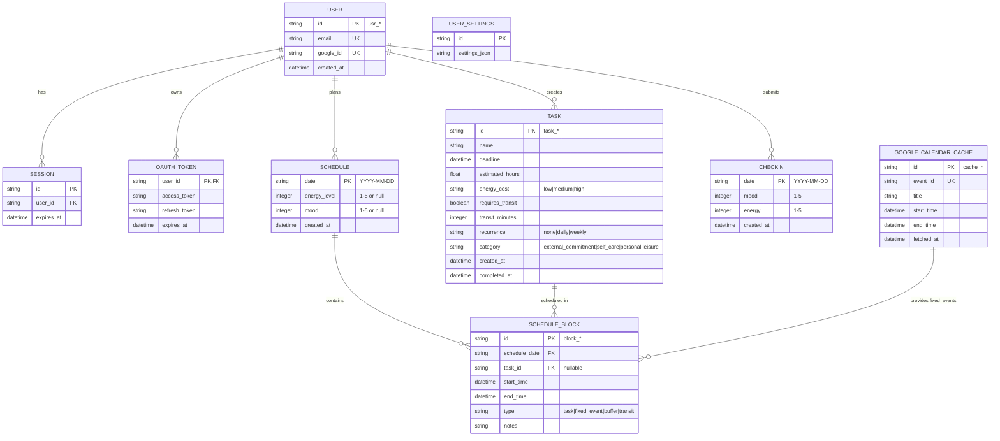

# Database Schema

Emo uses Cloudflare D1 (SQLite) for persistent data storage. This document outlines the table structure, relationships, and key constraints.

## Entity Relationship Diagram



## Table Definitions

### Authentication & User Management

#### `user`
Stores authenticated user profiles linked to Google accounts.

| Column | Type | Constraint | Notes |
|--------|------|-----------|-------|
| `id` | TEXT | PRIMARY KEY | Format: `usr_*` |
| `email` | TEXT | UNIQUE, NOT NULL | User's email address |
| `google_id` | TEXT | UNIQUE, NOT NULL | Google's user ID from OAuth |
| `created_at` | DATETIME | DEFAULT CURRENT_TIMESTAMP | Account creation timestamp |

**Indexes:** `email`, `google_id` (for OAuth lookups)

---

#### `session`
HTTP session tokens for authenticated requests.

| Column | Type | Constraint | Notes |
|--------|------|-----------|-------|
| `id` | TEXT | PRIMARY KEY | Session token (UUID) |
| `user_id` | TEXT | NOT NULL, FK → user(id) | Associated user |
| `expires_at` | DATETIME | NOT NULL | Session expiration time |

**Cascade:** ON DELETE CASCADE (user deleted → sessions deleted)  
**Cleanup:** Expired sessions should be pruned periodically

---

#### `oauth_token`
Google OAuth access & refresh tokens for Calendar API calls.

| Column | Type | Constraint | Notes |
|--------|------|-----------|-------|
| `user_id` | TEXT | PRIMARY KEY, FK → user(id) | One token per user |
| `access_token` | TEXT | NOT NULL | Current access token |
| `refresh_token` | TEXT | NULLABLE | For offline access; may be null after first refresh |
| `expires_at` | DATETIME | NOT NULL | Access token expiration |

**Cascade:** ON DELETE CASCADE

---

### Core Application Data

#### `task`
User's tasks with scheduling metadata.

| Column | Type | Constraint | Notes |
|--------|------|-----------|-------|
| `id` | TEXT | PRIMARY KEY | Format: `task_*` |
| `name` | TEXT | NOT NULL | Task description |
| `deadline` | DATETIME | NULLABLE | Optional hard deadline |
| `estimated_hours` | REAL | NOT NULL | Time estimate (e.g., 1.5) |
| `energy_cost` | TEXT | NOT NULL | `'low'`, `'medium'`, or `'high'` |
| `requires_transit` | BOOLEAN | NOT NULL DEFAULT 0 | Needs travel time? |
| `transit_minutes` | INTEGER | NOT NULL DEFAULT 0 | Expected travel time |
| `recurrence` | TEXT | NOT NULL DEFAULT 'none' | `'none'`, `'daily'`, or `'weekly'` |
| `category` | TEXT | NOT NULL | Task type (see below) |
| `created_at` | DATETIME | DEFAULT CURRENT_TIMESTAMP | Task creation time |
| `completed_at` | DATETIME | NULLABLE | Completion timestamp |

**Valid Categories:**
- `external_commitment` — meetings, appointments
- `self_care` — exercise, rest, medical
- `personal` — errands, admin
- `leisure` — hobbies, socializing

**Indexes:** `created_at`, `completed_at`, `deadline`

---

#### `schedule`
Daily schedule metadata (mood, energy level).

| Column | Type | Constraint | Notes |
|--------|------|-----------|-------|
| `date` | TEXT | PRIMARY KEY | Format: `YYYY-MM-DD` |
| `energy_level` | INTEGER | NULLABLE | Check-in value 1–5 |
| `mood` | INTEGER | NULLABLE | Check-in value 1–5 |
| `created_at` | DATETIME | DEFAULT CURRENT_TIMESTAMP | When schedule was created |

**Note:** One schedule per date. Check-in values are optional until user submits daily check-in.

---

#### `schedule_block`
Individual time blocks within a schedule (tasks, events, buffers, transit).

| Column | Type | Constraint | Notes |
|--------|------|-----------|-------|
| `id` | TEXT | PRIMARY KEY | Format: `block_*` |
| `schedule_date` | TEXT | NOT NULL, FK → schedule(date) | Associated date |
| `task_id` | TEXT | NULLABLE, FK → task(id) | Task ID (null for fixed events/buffer/transit) |
| `start_time` | DATETIME | NOT NULL | Block start (ISO 8601) |
| `end_time` | DATETIME | NOT NULL | Block end (ISO 8601) |
| `type` | TEXT | NOT NULL | Block category (see below) |
| `notes` | TEXT | NULLABLE | Additional context |

**Valid Types:**
- `task` — scheduled task
- `fixed_event` — imported from Google Calendar
- `buffer` — unscheduled free time
- `transit` — travel time before/after task

**Cascade:** ON DELETE CASCADE (schedule deleted → blocks deleted)  
**Set Null:** ON DELETE SET NULL for task_id (task deleted, block remains as placeholder)

**Indexes:** `schedule_date`, `task_id`, `start_time`

---

#### `checkin`
Daily mood & energy check-ins.

| Column | Type | Constraint | Notes |
|--------|------|-----------|-------|
| `date` | TEXT | PRIMARY KEY | Format: `YYYY-MM-DD` |
| `mood` | INTEGER | NOT NULL | 1–5 scale |
| `energy` | INTEGER | NOT NULL | 1–5 scale |
| `created_at` | DATETIME | DEFAULT CURRENT_TIMESTAMP | Submission time |

**Note:** One check-in per day (upsert on submission).

---

#### `calendar_cache`
Cached Google Calendar events (refreshed periodically).

| Column | Type | Constraint | Notes |
|--------|------|-----------|-------|
| `id` | TEXT | PRIMARY KEY | Format: `cache_*` |
| `event_id` | TEXT | UNIQUE, NOT NULL | Google's event ID |
| `title` | TEXT | NOT NULL | Event name |
| `start_time` | DATETIME | NOT NULL | Event start (ISO 8601) |
| `end_time` | DATETIME | NOT NULL | Event end (ISO 8601) |
| `fetched_at` | DATETIME | DEFAULT CURRENT_TIMESTAMP | Cache timestamp |

**Note:** Acts as a local mirror of Google Calendar. Implement TTL or periodic refresh (e.g., daily).

**Indexes:** `event_id`, `fetched_at`

---

#### `user_settings`
User preferences & configuration (stored as JSON).

| Column | Type | Constraint | Notes |
|--------|------|-----------|-------|
| `id` | TEXT | PRIMARY KEY | Format: `settings_*` |
| `settings_json` | TEXT | NOT NULL | JSON object with user prefs |

**Example:**
```json
{
  "daily_buffer_minutes": 90,
  "work_start_hour": 9,
  "work_end_hour": 17,
  "timezone": "America/New_York",
  "notifications_enabled": true
}
```

---

## Key Constraints & Relationships

### Foreign Keys
- `session.user_id` → `user.id` (CASCADE delete)
- `oauth_token.user_id` → `user.id` (CASCADE delete)
- `schedule_block.schedule_date` → `schedule.date` (CASCADE delete)
- `schedule_block.task_id` → `task.id` (SET NULL on delete)

### Unique Constraints
- `user.email` — one account per email
- `user.google_id` — one account per Google ID
- `oauth_token.user_id` — one token per user
- `checkin.date` — one check-in per day
- `calendar_cache.event_id` — no duplicate event cache entries
- `schedule.date` — one schedule per day

### Indexes
Recommended indexes for query performance:

```sql
CREATE INDEX idx_session_user_id ON session(user_id);
CREATE INDEX idx_schedule_block_date ON schedule_block(schedule_date);
CREATE INDEX idx_schedule_block_task ON schedule_block(task_id);
CREATE INDEX idx_task_created_at ON task(created_at);
CREATE INDEX idx_task_completed_at ON task(completed_at);
CREATE INDEX idx_calendar_cache_fetched ON calendar_cache(fetched_at);
```

---

## Data Lifecycle

### Task Lifecycle
1. **Created** — User inputs task via `/api/chat`
2. **Scheduled** — Task assigned to `schedule_block` on a date
3. **Completed/Skipped** — `completed_at` set; next occurrence created if recurring
4. **Deleted** — Removed from `task` table (cascades to orphan blocks)

### Session Lifecycle
1. **Created** — After successful OAuth callback
2. **Validated** — On each protected request
3. **Expired** — After 30 days (or as configured)
4. **Pruned** — Periodically delete old expired sessions

### Schedule Generation
1. **Fetch** calendar events → `calendar_cache`
2. **Fetch** task backlog → available `task` records
3. **Combine** events + tasks → `schedule_block` entries
4. **Apply** rules (energy, transit, buffers)
5. **Persist** → `schedule` + `schedule_block` rows

---

## Migration Strategy

Current schema is in `server/migrations/0000_schema.sql`. Use Wrangler D1 migrations:

```bash
wrangler d1 migrations create <name>
# Edit migration file
wrangler d1 migrations apply --remote
```

Always test migrations locally before deploying to production.
